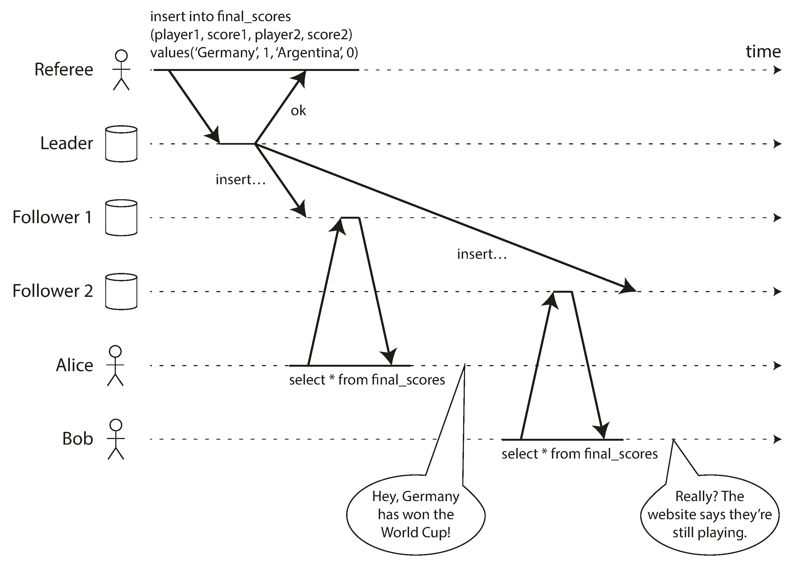
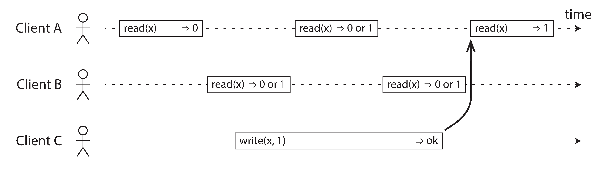
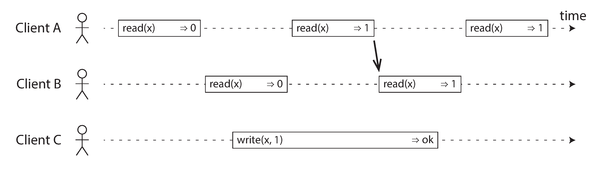
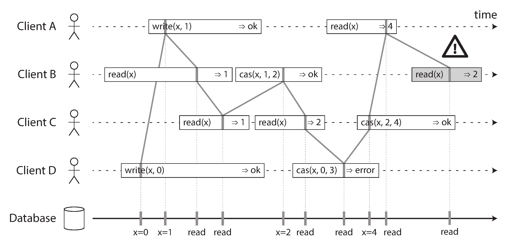
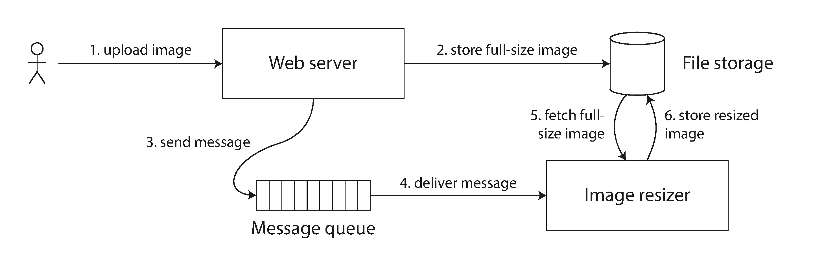
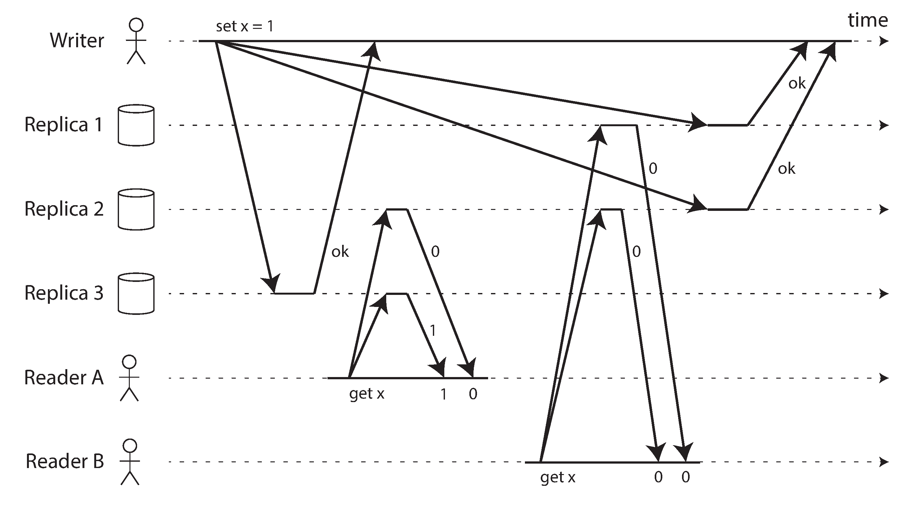
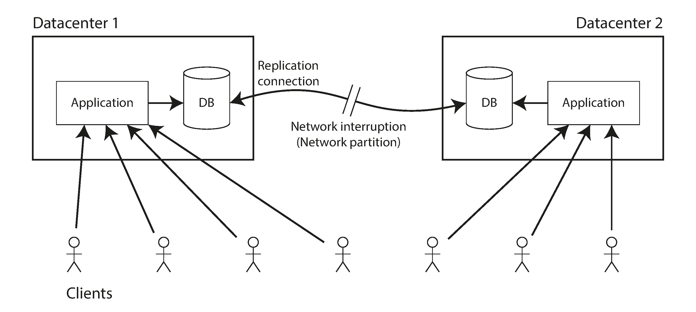
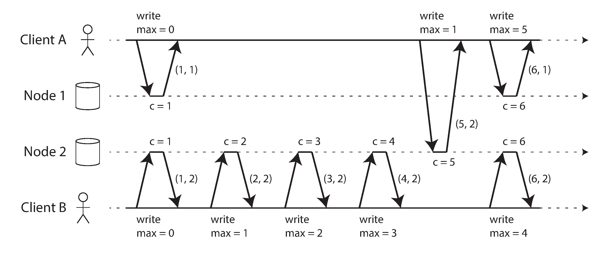

# 9. 일관성과 합의

- 8장에서 설명했듯이 분산 시스템에서는 많은 것들이 잘못될 수 있다. (8장에서 설명한 모든 문제가 발생할 수 있다고 가정.) 가장 간단한 방법은 전체 서비스가 실패하도록 두고 사용자에게 오류 메시지를 보여주는 것입니다.
- 이 해결책을 받아들이기 어렵다면 결함을 **견뎌낼(tolerating)** 방법을 찾아야 한다.
- 이번 장에서는 내결함성을 지닌 분산 시스템을 구축하는 데 쓰이는 알고리즘과 프로토콜의 몇 가지 예를 얘기한다.


## 일관성 보장

- 복제 데이터베이스는 대부분 최소한 최종적 일관성을 제공한다.
  - 데이터베이스에 쓰기를 멈추고 불특정 시간 동안 기다리면 결국 모든 읽기 요청이 같은 값을 반환한다.
  - 모든 복제본이 결국 같은 값으로 수렴되기를 기대하므로 최종적 일관성보다 **수렴**이 더 나은 이름일지도 모른다.

- 그러나 이것은 매우 약한 보장이며, 언제 복제본이 수렴될지에 대해서는 아무것도 얘기하지 않는다.

- 약한 보장만 제공하는 데이터베이스를 다룰 때는 그 제한을 계속 알아야 하고 뜻하지 않게 너무 많은 것을 가정하면 안된다.

데이터 시스템이 선택적으로 제공할 수 있는 더욱 강한 일관성 모델을 살펴본다.

- 공통적으로 사용되는 가장 강한 일관성 모델 중 하나인 선형성(linearizability)을 살펴보고 장점과 단점을 검토한다.
- 분산 시스템에서 이벤트 순서화 문제("순서화 보장"), 특히 인과성과 전체 순서화와 관련된 문제를 검토한다.
- "분산 트랜잭션과 합의" 에서 분산 트랜잭션을 원자적으로 커밋하는 방법을 알아본다.

## 선형성

- 기본 아이디어
  - 시스템에 데이터 복사본이 하나만 있고 그 데이터를 대상으로 수행하는 모든 연산은 원자적인 것처럼 보이게 만드는 것

- **원자적 일관성(atomic consitency), 강한 일관성(strong consitency), 즉각 일관성(immediate consitency), 외부 일관성(external consitency)** 이라고도 한다.
- 선형성 시스템에서는 클라이언트가 쓰기를 성공적으로 완료하자마자 그 데이터베이스를 읽는 모든 클라이언트는 방금 쓰여진 값을 볼 수 있어야 한다. 다시 말해 **최신성 보장(recency guarantee)** 이다.



### 시스템에 선형성을 부여하는 것은 무엇인가?

- 시스템에 데이터 복사본이 하나뿐인 것처럼 보이게 만드는 것이다.
- 분산 시스템 분야에서, 동시에 같은 키 x를 읽고 쓰는 선형성 데이터베이스에서 x는 **레지스터(register)** 라고 불린다.



- 이 예제에서 레지스터는 두 가지 종류의 연산이 있다.
  - `read(x) => v` 는 클라이언트가 레지스터 x의 값을 읽기를 요청했고 데이터베이스가 값 v를 반환했다는 것을 의미한다.
  - `write(x, v) => r` 은 클라이언트가 레지스터 x의 값을 v로 설정하라고 요청했고 데이터베이스가 응답 r(ok일 수도 error일 수도 있다)을 반환했다는 것을 의미한다.

- 읽기 연산이 처리되는 시점에 쓰기의 영향이 발생했는지 알 수 없으므로 연산은 동시에 실행된다.



- (그림 9-3) 시스템을 선형적으로 만들려면 또 다른 제약을 추가해야 한다.
- 읽기가 새로운 값을 반환한 적이 있은 후에는 모든 후속 읽기(같은 클라이언트에서 실행되든 다른 클라이언트에서 실행되든)도 반드시 새로운 값을 반환해야 한다.



- (그림 9-4) 읽기와 쓰기 외에 세 번째 종류의 연산을 추가한다.
  - `cas(x, v_old, v_new) => r` 은 클라이언트가 원자적 `compare-and-set` 연산을 요청했다는 뜻이다.
- 선형성의 요구사항은 연산 표시를 모든 선들이 항상 시간순으로 진행되야 하고(왼손에서 오른쪽으로) 결코 뒤로 가서는 안된다는 것이다.
- 클라이언트 B의 마지막 읽기는 선형적이지 않다.
  - 유효한 순차 순서로 배열되는지 확인함으로써 시스템의 동작이 선형적인지 테스트할 수도 있다.

> 선형성 대 직렬성
> (Linearizability Versus Serializability)

선형성과 직렬성은 혼동하기 쉽다. 그러나 이들 두가지는 매우 다른 보장이며 이들을 구별하는게 중요.

- 직렬성(Serializability)
  - 직렬성은 모든 트랜잭션이 여러 객체(로우, 문서, 레코드)를 읽고 쓸 수 있는 상황에서의 **트랜잭션들**의 격리 속성이다.
  - 트랜잭션들이 **어떤** 순서에 따라 실행되는 것처럼 동작하도록 보장해준다.

- 선형성(Linearizability)
  - 선형성은 레지스터(**개별 객체**)에 실행되는 읽기와 쓰기에 대한 최신성 보장이다.
  - 연산을 트랜잭션으로 묶지 않아서 충돌 구체화 같은 부가적인 수단을 사용하지 않으면 쓰기 스큐 같은 문제를 막지 못한다.

데이터베이스는 직렬성과 선형성을 모두 제공할 수도 있으며 이런 조합은 **엄격한 직렬성(strict serializability)**이나 **강한 단일 복사본 직렬성(strong one-copy serializability)**이라고 한다.
- 2단계 잠금이나 실제적인 직렬 실행을 기반으로 한 직렬성 구현은 보통 선형적이다.
- However, 직렬성 스냅숏 격리(SSI)는 선형적이지 않다.
  - 일관된 스냅숏의 요점은 스냅숏에 스냅숏보다 나중에 실행된 쓰기를 포함하지 않는다는 것이고 따라서 스냅숏에서 읽으면 선형적이지 않다.

### 선형성에 기대기

```선형성이 중요한 요구사항이 되는 영역이 몇가지 있다.```

#### 잠금과 단일 리더 선출
- 단일 리더 복제를 사용하는 시스템은 리더가 여러 개(스플릿 브레인)가 아니라 진짜로 하나만 존재하도록 보장해야 한다.
- 분산 잠금과 리더 선출을 구현하기 위해 아파치 주키퍼(Apache ZooKeeper)나 etcd같은 코디네이션 서비스는 합의 알고리즘을 사용해 선형성 연산을 내결함성이 있는 방식으로 구현한다.
- 오라클 리얼 애플리케이션 클러스터(racle Real Application Clusters, RAC) 같은 분산 데이터베이스에서 훨씬 세분화된 수준으로 사용되기도 한다.
#### 제약 조건과 유일성 보장
- 유일성 제약 조건은 데이터베이스에서 흔하다.(ex. 사용자명이나 이메일 주소, 파알 저장 경로와 파일명)
  - 이러한 조건을 강제하고 싶다면 선형성이 필요한다.
  - 은행 잔고가 음수가 되지 않게 하거나 동시에 같은 좌석을 예약하지 못하게 보장하고 싶을 때, 모든 노드가 동의하는 하나의 최신값이 있기를 요구한다.
- 실제 애플리케이션에서는 때때로 이런 제약 조건을 느슨하게 다루지만 관계형 데이터베이스에서 전형적으로 볼 수 있는 엄격한 유일성 제약 조건은 선형성이 필요하다.
#### 채널 간 타이밍 의존성

- 파일 저장 서비스가 선형적이면 이 시스템은 잘 동작하지만. 선형적이지 않으면 경쟁 조건의 위험이 있다.
  - 선형성의 최신성 보장이 없으면 이 두채널 사이에 경쟁 조건이 발생할 수 있다.
- 선형성이 경쟁 조건을 회피하는 유일한 방법은 아니지만 이해하기에 가장 단순한다.

### 선형성 시스템 구현하기

시스템이 내결함성을 지니도록 만드는 가장 흔한 방법은 복제를 사용하는 것이다. 복제 방법을 살펴보면서 선형적으로 만들 수 있는지 비교.
- 단일 리더 복제 : 선형적이 될 가능성 있음
  - 리더나 동기식으로 갱신된 팔로워에서 실행한 읽기는 선형적이 될 가능성이 있다.
  - 읽기에 리더를 사용하려면 누가 리더인지 안다고 가정
- 합의 알고리즘 : 선형적
  - 합의 프로토콜에는 스플릿 브레인과 복제본이 뒤처질 문제를 막을 수단이 포함된다.
  - 이런 세부사항 덕에 합의 알고리즘은 선형성 저장소를 안전하게 구현할 수 있다.

#### 선형성과 정족수



- 엄격한 정족수를 사용한 읽기 쓰기는 선형적인 것처럼 보인다. 그러나 네트워크 지연의 변동이 심하면 경쟁 조건이 생길 수 있다.
- 정족수 조건이 만족됨에도 실행은 선형적이지 않을 수 있다.
- 성능이 떨어지는 비용을 지불하고 다이나모 스타일 정족수를 선형적으로 만드는 것도 가능한다.
  - 읽기를 실행하는 클라이언트는 결과를 애플리케이션에 반환하기 전에 읽기 복구를 동기식으로 수행해야하고 쓰기를 실행하는 클라이언트는 쓰기 요청을 보내기 전에 노드들의 정족수로부터 최신 상태를 읽어야 한다.
  - 이 방법으로는 선형성 compare-and-set 연산은 합의 알고리즘이 필요하므로 구현 불가.
  - 요약하면, 다이나모 스타일 복제를 하는 **리더 없는 시스템은 선형성을 제공하지 않는다** 고 보는게 안전하다.

### 선형성의 비용



- 네트워크가 끊기면 선형성과 가용성 사이에서 선택해야만 한다.
- 애플리케이션에서 선형성 읽기와 쓰기를 요구한다면 네트워크가 끊길 때 리더와 연결할 수 없는 데이터센터에서는 그 애플리케이션을 사용할 수 없다.

#### CAP 정리

- 위 문제는 다른 경우에도 발생할 수 있다.
  - 애플리케이션에서 선형성을 **요구하고** 네트워크 문제 때문에 일부 복제 서버가 다른 복제 서버와 연결이 끊기면 일부 복제 서버는 연결이 끊긴 동안은 요청을 처리할 수 없다. 네트워크 문제가 고쳐질 때까지 기다리거나 오류를 반환해야 한다. (즉, **가용성이 없다.**) 
  - 애플리케이션에서 선형성을 **요구하지 않는다면** 각 복제 서버가 다른 복제 서버와 연결이 끊기더라도 독립적으로 요청을 처리하는 방식으로 쓰기를 처리할 수 있다. 이 경우 애플리케이션은 네트워크 문제에 직면해도 **가용한** 상태를 유지하지만 그 동작은 선형적이지 않다.
- 선형성이 필요 없는 애플리케이션은 네트워크 문제에 더 강인한다.
  - 이런 통찰력은 **CAP 정리**로 알려졌다.
- CAP는 데이터베이스에서 트레이드오프에 대한 논의를 시작하려는 목적으로 정확한 정의 없이 경험 법칙으로 제안되었다.
- 공식적으로 정의된 CAP 정리는 매우 범위가 좁으며, 오직 하나의 일관성 모델과 한 종류의 결함만 고려한다.
  - 더 이상은 실용적인 가치는 없다.

> 도움이 안되는 CAP 정리

- CAP는 때때로 **일관성(Consistency), 가용성(Availability), 분단 내성(Partition tolerance) 이라는 세 개 중 두 개를 고르라**는 것으로 표현된다.
- CAP는 **네트워크 분단이 생겼을 때 일관성과 가용성 중 하나를 선택하라**는 의미로 보는 것이 좋다.
- 또한 **가용성**이란 단어는 몇 가지 모순된 정의가 있다.

#### 선형성과 네트워크 지연

- 선형성은 유용한 보장이지만 현실에서는 실제로 선형적인 시스템은 놀랄만큼 드물다.
- **좋은 성능을 위해 선형성이 손실**되는 트레이드 오프가 발생.
- 선형성을 원하면 읽기와 쓰기 요청의 응답 시간이 적어도 네트워크 지연의 불확싱성에 비례한다.
- 지연시간에 민감한 시스템에서는 이러한 트레이드 오프가 중요하다.

## 순서화 보장

선형성 레지스터는 데이터 복사본이 하나만 있는 것처럼 동작하고 모든 연산이 어느 시점에서 원자적으로 효과가 나타나는 것처럼 보이며 이는 **순서화**라고 표현할 수 있다.

- 단일 리더 복제에서 리더의 주 목적은 복제 로그에서 쓰기의 순서를 결정하는 것입니다.
- 직렬성은 트랜잭션들이 어떤 일련 순서에 따라 실행되는 것처럼 동작하도록 보장하는 것과 관련되어 있다.
- 분산 시스템에서 타임 스탬프와 시계 사용은 무질서한 세상에서 질의를 부여하는 또 다른 시도입니다.

순서화, 선형성, 합의 사이에는 깊은 연결 관계가 있음을 드러냅니다.

### 순서화와 인과성

순서화는 인과성을 보존하는데 도움을 줍니다.

- 일관된 순서로 읽기에서 대화의 관찰자가 질문에 대한 응답을 먼저 보고 나서 응답된 질문을 보게되는 예를 보았는데, 이러한 상황을 질문과 답변 사이에 **인과적 의존성(causal dependency)** 가 있다고 말한다.
- 동시 쓰기 감지에서 두 개의 연산 A와 B가 있으면 세 가지 가능성이 있을 수 있다. A가 B보다 먼저, 같이, 이후에 실행되는 경우가 있는데 이처럼 **이전 발생(happened before)** 관계는 인과성을 표현하는 또 다른 방법입니다.
- 트랜잭션을 스냅숏 격리의 맥락에서 트랜잭션은 일관된 스냅숏으로부터 읽는다고 했다. 이때 일관적이란 **인과성에 일관적(consistent with causality)** 라는 의미입니다.

인과성은 이벤트에 순서를 부과한다. 결과가 나타나기 전에 원인이 발생하고, 메시지를 받기 전에 메시지를 보냅니다.

시스템이 인과성에 의해 부과된 순서를 지키면 그 시스템은 **인과적으로 일관적(causally consistent)** 라고 한다.

#### 인과적 순서가 전체 순서는 아니다

- **전체 순서(total order)**은 어떤 두 요소를 비교할 수 있게 하므로 두 요소가 있으면 항상 어떤 것이 더 크고 어떤 것이 더 작은지 말할 수 있다.
- 수학적 집합은 이와 달리 **비교불가(incomparable)**하고, **부분적으로 순서가 정해진다.(partially ordered).**
- 전체 순서와 부분 순서의 차이점은 다른 데이터베이스 일관성 모델에 반영된다.
  - **선형성** 
    - 선형성 시스템에서는 연산의 **전체 순서**를 정할 수 있다.
  - **인과성** 
    - 두 연산 중 다른 것뽀다 먼저 실행되지 않았다면 두 연산이 동시적이라고 말했다. 인과성이 전체 순서가 아닌 **부분 순서**를 정의한다는 이야기 입니다.
- 이러한 정의를 통해서 선형성 데이터스토어는 동시적 연산이 없다. 하나의 타임라인이 있고 모든 연산은 그 타임라인을 따라서 전체 순서가 정해져야 한다.
- 동시성은 타임라인이 갈라졌다 다시 합쳐지는 것을 의미한다.
- 깃의 히스토리는 인과적 의존성 그래프와 매우 유사하다.

#### 선형성은 인과적 일관성보다 강하다

- **선형성은 인과성을 내포한다.**
- 선형성은 인과성을 보장해준다는 사실은 이해하기도 쉽고 매력적으로 보일 수도 있지만, 이는 네트워크 지연에 따라 성능과 가용성에 해가 될 수 있다.
- 좋은 소식은 절충이 가능하다. 선형적으로 만들지 않고도 인과적 일관성을 만족시킬 수 있다.
- 대부분의 시스템에서 **실제로 필요한 것은 선형성이 아닌 인과성**입니다.

#### 인과적 의존성 담기

- 인과성을 유지하기 위해서는 어떤 연산이 어떤 다른 연산보다 **먼저 실행됐는지** 알아야 한다.
- 인과적 의존성을 결정하려면 시스템에 있는 노드에 관한 "지식"을 기술할 방법이 필요하다.
  -  노드가 쓰기 Y를 실행했을 때 값 X를 이미 본 상황이라면 X와 Y는 인과적인 관련이 있을지도 모른다.
- 앞에서는 리더 없는 데이터스토어는 갱신 손실 방지를 위해 같은 키에 대한 동시 쓰기를 검출해야하며, 인과적 의존성은 여기서 더 나아가서 **버전 벡터(version vector)**를 일반화할 수 있다.
  - 인과적 순서를 결정하기 위해 데이터베이스는 애플리케이션이 데이터의 어떤 버전을 읽었는지 알아야한다.

### 일련번호 순서화

- 인과성은 중요한 이론적 개념이지만 모든 인과적 의존성을 추적하는 것은 실용성이 떨어집니다.
- 더 좋은 방법으로는 일련번호나 타임스탬프를 써서 이벤트의 순서를 정할 수 있다.
  - 물리적 시계에서 얻을 필요 없이 논리적 시계에서 얻으면 된다.
- 이러한 일련번호나 타임스탬프는 크기가 작고 전체 순서를 제공한다.
- 특히 인과성에 일관적인 전체 순서대로 일련번호를 생성할 수 있다.
  - 연산 A가 연산 B보다 인과적으로 먼저 실행되었다면 A는 전체 순서에서도 B보다 먼저입니다.
- 단일 리더 복제를 쓰는 데이터베이스에서는 복제 로그가 인과성에 일관적인 쓰기 연산의 전체 순서를 정의한다.
  - 리더는 연산마다 카운터를 증가시키고 복제 로그의 연산에 단조 증가하는 일련번호를 할당하기만 하면 된다.

#### 비인과적 일련번호 생성기

- 단일 리더가 없다면 연산에 사용할 일련번호를 생성하는 방법이 명확해 보이지 않다. 현실에서는 다양한 방법이 사용된다.
  - 각 노드가 자신만의 독립적인 일련번호 집합을 생성할 수 있다. (몇 비트를 예약해서 고유 노드 식별자를 포함하는 방법입니다.)
  - 각 연산에 일 기준 시계에서 얻은 타임스탬프를 붙일 수 있다.
  - 일련번호 블록을 미리 할당할 수 있다.
- 위의 세가지 선택지는 카운터를 증가하는 단일 리더에 모든 연산보다는 확장성이 좋으나, 생성된 일련번호가 **인과성에 일관적이지 않다.**
- 아래의 인과성 문제점이 발생할 수 있다.
  - 각 노드는 초당 연산수가 다를 수 있다.
  - 물리적 시계에서 얻은 타임스탬프는 시계 스큐에 종속적이어서 인과성에 일관적이지 않게 될 수 있다.
  - 블록 할당자의 경우 한 연산이 1001과 2000사이의 구간에서 일련번호를 받고 인과적으로 나중에 실행되는 연산이 1과 1000사이의 구간에서 일련번호를 받을 수도 있다.

#### 램포트 타임스탬프

- 앞에서 살펴본 일련번호 생성시는 인과성에 비일관적이지만 인과성에 **일관적인** 일련번호를 생성하는 간단한 방법이 있으며 이를 **램포트 타임스탬프(Lamport timestamp)** 라고 부릅니다.
- 램포트 타임스탬프는 **(카운터, 노드ID)** 의 쌍입니다.



- 램포트 타임스탬프는 물리적 일 기준 시계와 아무 관련이 없으나 전체 순서화를 제공한다.
  - 두 타임 스탬프가 있으면 카운터가 큰 것이 타임스탬프가 크며, 카운터 값이 같으면 노드 ID가 큰 것이 타임 스탬프가 큽니다.
- 핵심 아이디어는 모든 노드와 모든 클라이언트가 본 카운터 값 중 **최댓값**을 추적하고 모든 요청에 그 최댓값을 포함한다.
- 램포트 타임스탬프는 버전 벡터와 혼동될 수 있지만 목적이 다릅니다.
  - 버전 벡터는 두 연산이 동시적인지 또는 어떤 연산이 다른 연산에 인과적으로 의존하는지 구별할 수 있지만 램포트 타임스탬프는 항상 전체 순서화를 강제한다.
  - 램포트 타임스탬프의 전체 순서화로부터 두 연산이 동시적인지 또는 인과적으로 의존성이 있는지를 알 수 없다.
  - 버전 벡터보다 램포트 타임스탬프가 좋은 점은 크기가 더 작다는 것이다.

#### 타임스탬프 순서화로는 충분하지 않다

- 램포트 타임스탬프가 인과성에 일관적인 연산의 전체 순서를 정의하지만 분산 시스템의 공통 문제를 해결하는 데 아주 충분하지는 않다.
  - 두 사용자가 동시에 동일한 사용자명으로 계정을 생성하려고 하면 둘 중 한 명은 성공하고 다른 사람은 실패해야 한다.
- 이 방법은 사후에 성공하는 쪽을 결정하는 데는 효과적이다. 시스템에서 사용자명 생성 연산을 모두 모으면 그들의 타임스탬프를 비교할 수 있다.
- 그러나 노드가 사용자로부터 사용자명 생성 요청을 막 받고 그 요청이 성공해야 하는지 실패해야 하는지 **당장** 결정해야 할 때는 이 방법으로는 부족하다.
- 결론적으로, 사용자명에 대해 유일성 제약 조건 같은 것을 구현하려면 연산의 전체 순서가 있는 것으로는 충분하지 않다. 언제 그 순서가 확정되는지도 알아야 한다.
  - 이를 해결하는 아이디어로 **전체 순서 브로드캐스트**가 등장했다.

### 전체 순서 브로드캐스트

단일 리더 복제는 한 노드를 리더로 선택하고 리더의 단일 CPU 코어에서 모든 연산을 차례대로 배열함으로써 연산의 전체 순서를 정한다. 분산 시스템 분야에서 이 문제는 **전체 순서 브로드캐스트(total order broadcast)** 나 **원자적 브로드 캐스트(atomic broadcast)** 로 알려져 있다.

전체 순서 브로드캐스트는 보통 노드 사이에 메시지를 교환하는 프로토콜로 기술되며 아래의 두 가지 안전성 속성을 항상 만족해야 한다.

- 신뢰성 있는 전달(reliable delivery)
  - 어떤 메시지도 손실되지 않습니다. 메시지가 한 노드에 전달되면 모든 노드에도 전달된다.
- 전체 순서가 정해진 전달(Totally ordered delivery)
  - 메시지는 모든 노드에 같은 순서로 전달된다.

전체 순서 브로드캐스트를 구현하는 올바른 알고리즘은 노드나 네트워크에 결함이 있다라도 신뢰성과 순서화 속성이 항상 만족되도록 보장해야 한다.

#### 전체 순서 브로드캐스트 사용하기

- 주키퍼나 etcd 같은 합의 서비스는 전체 순서 브로드캐스트를 실제로 구현한다.
- 모든 메시지가 데이터베이스의 쓰기를 나타내고 모든 복제 서버가 같은 쓰기 연산을 같은 순서로 처리하면 복제 서버들은 서로 일관성 있는상태를 유지한다. 이 원리를 **상태 기계 복제(state machine replication)** 이라고 한다.
- 전체 순서 브로드캐스트는 직렬성 트랜잭션을 구현하는데도 쓸 수 있다.
  - 모든 노드가 메시지들을 같은 순서로 처리한다면 데이터베이스의 파티션과 복제본은 서로 일관적인 상태를 유지한다.
- 전체 순서 브로드캐스트의 중요한 특면은 메시지가 전달되는 시점에 그 순서가 고정된다.
  - 이 때문에 전체 순서 브로드캐스트가 타임스탬프 순서화보다 강한다.
- 전체 순서 브로드캐스트를 보는 또 다른 관점은 로그를 만드는 방법 중 하나입니다.
  - 전체 순서 프로드캐스트는 펜싱 토큰을 구현하는데도 유현한다.
  - 잠금을 획득하는 모든 요청은 메시지로 로그에 추가되고 모든 메시지는 일련번호가 붙는다. 일련번호는 단조 증가하므로 펜싱 토큰의 역할을 할 수 있다.

#### 전체 순서 브로드캐스트를 사용해 선형성 저장소 구현하기

- 전체 순서 브로드캐스트는 비동기식입니다.
  - 메시지는 고정된 순서로 신뢰성 있게 전달되도록 보장되지만 언제 메시지가 전달될지는 모장되지 않습니다.
- 전체 순서 브로드캐스트 구현을 기반으로 선형성 저장소를 만들 수 있다.
  - compare-and-set 연산을 다음과 같이 구현할 수 있다.
    - 메시지를 로그에 추가해서 점유하기 원하는 사용자명을 시험적으로 가리킵니다.
    - 로그를 읽고, 추가한 메시지가 되돌아오기를 기다립니다.
    - 원하는 사용자명을 점유하려고 하는 메시지가 있는지 확인한다.
- 위 절차는 선형성 쓰기를 보장하지만 선형성 읽기는 보장하지 않습니다. 즉, 비동기로 갱신되는 저장소를 읽으면 오래된 값이 읽힐 수 있다. (**타임라인 일관성** 이라 부릅니다.)
- 읽기를 선형적으로 만들려면 아래의 선택지가 있다.
  - 로그를 통해 순차 읽기를 할 수 있다. 고르에 메시지를 추가하고 로그를 읽어서 메시지가 되돌아왔을 때 실제 읽기를 수행하면 된다.
  - 로그에서 최신 로그 메시지의 위치를 선형적 방법으로 얻을 수 있다면 그 위치를 질의하고 그 위치까지의 모든 항목이 전달되기를 기다린 후 읽기를 수행할 수 있스빈다.
  - 쓰기를 실행할 때 동기식으로 갱신돼서 최신이 보장되는 복제 서버에서 읽으 수 있다.

#### 선형성 저장소를 사용해 전체 순서 브로드캐스트 구현하기

- 위에서는 전체 순서 브로드캐스트로부터 선형성 compare-and-set 연산을 구현하는 방법이었으나 이 반대도 가능한다.
- 가장 쉬운 방법은 정수를 저장하고, 원자적 increment-and-get 연산이 지원되는 선형성 레지스터가 있다고 가정하는 것입니다.
  - 이 연산을 통해 레지스터에서 얻은 값을 일련번호로 베시지에 붙입니다.
  - 메시지를 모든 노드에 보낼 수 있고 수신자들은 일련번호 순서대로 메시지를 전달한다.
- 핵심은 선형성 compare-and-set(혹은 increment-and-get) 레지스터와 전체 순서 브로드캐스트는 둘 다 **합의와 동등하다고(equivalent to consensus)** 증명할 수 있다.

## 분산 트랜잭션과 합의